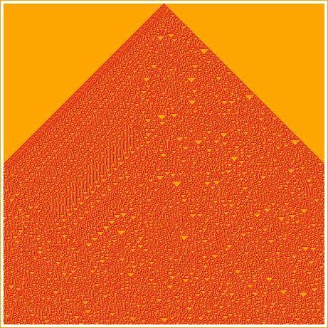

# rules

Sourav Datta

```racket
 (require rules) package: rules
```

## 1. Overview

A simple language to draw automaton rules. A rule specifies the
configuration of a single cell in a grid of cells depending upon the
state of three cells - \(row - 1, col -1\), \(row - 1, col\) and \(row -
1, col + 1\).

Here is how we define Rule 30 (http://mathworld.wolfram.com/Rule30.html)

Add ‘\#lang s-exp rules‘ at the top

```racket
(value 30)             
(dimension 451)        
(init-conf ((0 225 1)))
```



This will create a grid of 451x451 and place a single on cell at \(0,
255\). The rest of the grid will be derived by applying Rule 30
repeatedly for each column.

## 2. Program stucture

A pogram is only three lines of code.

The first line is a specification of the rule number

`(value` `n)`

The number is converted to an 8 bit binary number and that corresponds
to the result states of the grid configurations. For example rule 30
corresnponds to binary value 00011110, hence, the rule configuration is
- \(1, 1, 1\) -> 0, \(1, 1, 0\) -> 0, \(1, 0, 1\) -> 0, \(1, 0, 0\) ->
1, \(0, 1, 1\) -> 1, \(0, 1, 0\) -> 1, \(0, 0, 1\) -> 1, \(0, 0, 0\) ->
0. Alternatively, the first line could be a binary specification of the
8 bits like

`(binary` `0` `0` `0` `1` `1` `1` `1` `0)`

The second line specifies the dimension of the board

`(dimension` `N)`

This creates a square board of N x N.

The third line gives the initial configuration of the board

`(init-conf` `((row1` `col1` `1)` `(row2` `col2` `0)` `...))`

## 3. Functions

```racket
(value n) -> void?     
  n : positive-integer?
```

specifies the rule value

```racket
(binary n1 n2 n3 n4 n5 n6 n7 n8) -> void?
  n1 : integer?                          
  n2 : integer?                          
  n3 : integer?                          
  n4 : integer?                          
  n5 : integer?                          
  n6 : integer?                          
  n7 : integer?                          
  n8 : integer?                          
```

specifies the rule value in binary

```racket
(dimension n) -> void? 
  n : positive-integer?
```

specifies the size of the square grid

```racket
(init-conf confs) -> void?
  confs : list?           
```

specifies the initial configuration of the grid
